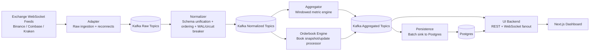
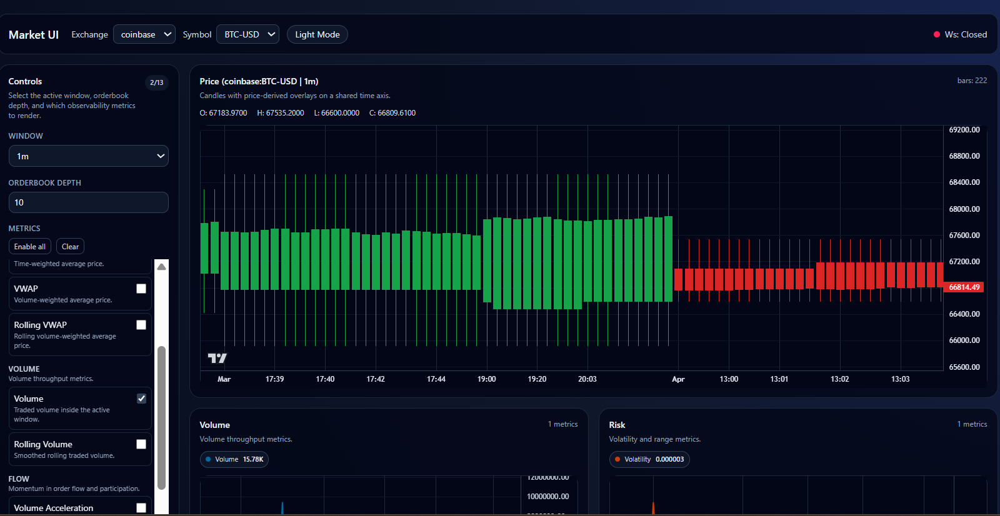
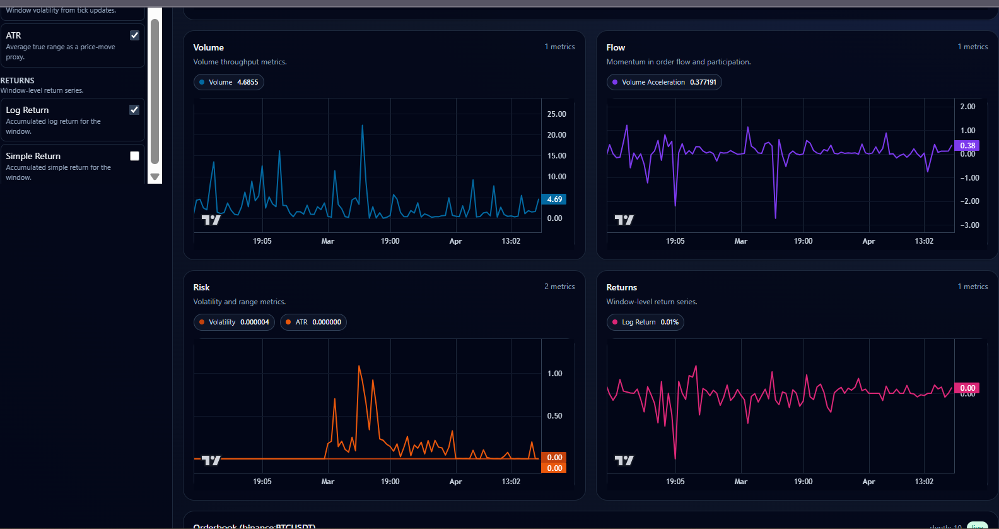
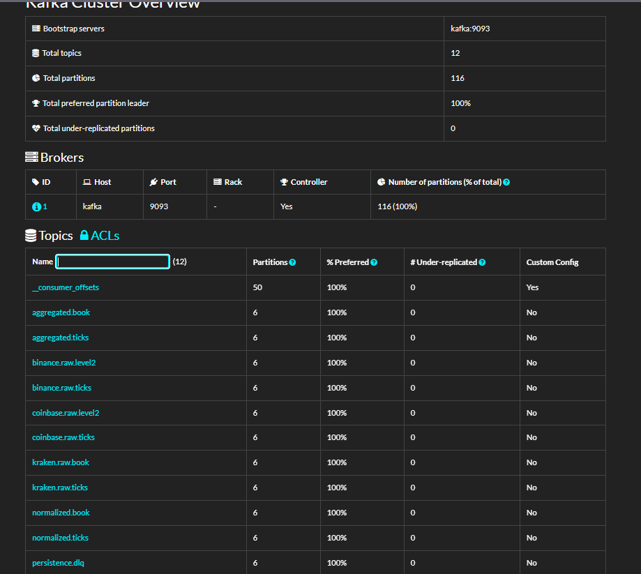

# Market Tick Aggregator

Market Tick Aggregator is an end-to-end real-time market data platform that ingests exchange feeds, normalizes heterogeneous payloads, computes windowed market metrics, persists aggregates to Postgres, and serves a live observability dashboard over REST and WebSocket.

The repository is structured as a complete streaming system rather than a single Kafka demo or a UI-only project. It shows how raw exchange events can be translated into a clean internal contract, processed by independent services, stored durably, and inspected live by people who can use the system to gather data and make better informed decisions on their trades.

## System Overview


## Dashboard Preview


## What This System Does

- Connects to live WebSocket feeds from Binance, Coinbase, and Kraken
- Publishes raw exchange events into Kafka topics
- Normalizes exchange-specific payloads into shared tick and book schemas
- Preserves ordered processing per stream key
- Computes candles and derived metrics across windows from `5s` to `24h`
- Builds and flushes orderbook snapshots for live depth visualization
- Persists aggregated ticks and books into Postgres
- Exposes a Next.js dashboard backed by REST for historical seed data and WebSocket for live updates
- Exposes observability surfaces through Prometheus, Kafdrop, and pgAdmin

## Why This Project Is Interesting

This project demonstrates:

- multi-exchange protocol handling
- Kafka-based event transport
- keyed ordered processing
- backpressure and bounded queue management
- circuit breaker and WAL-based failure handling
- tumbling and rolling metric computation
- replay-safe persistence
- an observability UI built directly on top of the streaming system

## Architecture

The image above is the presentation-friendly system view. The flowchart below is the editable text version of the same architecture.



## Data Flow

1. The `adapter` connects to exchange WebSocket feeds and publishes raw events into Kafka.
2. The `normalizer` consumes raw topics, converts payloads into shared schemas, and enforces per-stream ordering.
3. Normalized ticks are consumed by the `aggregator`, which computes OHLC candles and derived metrics.
4. Normalized books are consumed by the `orderbook` service, which maintains in-memory books and flushes top-of-book snapshots.
5. The `persistence` service batches aggregated Kafka records into Postgres.
6. The `ui-backend` reads historical data from Postgres and live updates from Kafka.
7. The `ui` dashboard renders historical seed data first, then continues live via WebSocket.

## Modules

| Module | Role |
| --- | --- |
| [`adapter`](adapter/README.md) | Exchange feed ingestion and raw Kafka publishing |
| [`normalizer`](normalizer/README.md) | Exchange schema unification, ordering, backpressure, WAL |
| [`aggregator`](aggregator/README.md) | Windowed OHLC and metric computation |
| [`orderbook`](orderbook/README.md) | In-memory book maintenance and orderbook flush generation |
| [`persistence`](persistence/README.md) | Batched durable sink into Postgres |
| [`ui-backend`](ui-backend/README.md) | REST + WebSocket API layer |
| [`ui`](ui/README.md) | Dashboard for candles, grouped metrics, and orderbook depth |
| `shared` | Shared logging, config, and metrics helpers |

## Exchanges and Streams

The current development configuration focuses on one instrument per exchange so the full stack remains easy to run locally and in containers:

| Exchange | Tick Stream | Orderbook Stream | Symbol |
| --- | --- | --- | --- |
| Binance | `aggTrade` | `depth` | `BTCUSDT` |
| Coinbase | `ticker` | `level2_batch` | `BTC-USD` |
| Kraken | `ticker` | `book` | `BTC/USD` |

Coinbase orderbook uses `level2_batch` so book data can be consumed without authenticated WebSocket setup while the downstream pipeline still treats it as logical level-2 data.

## Windows and Metrics

The aggregator computes metrics over multiple windows:

- `5s`
- `10s`
- `30s`
- `1m`
- `2m`
- `5m`
- `10m`
- `30m`
- `1h`
- `2h`
- `6h`
- `12h`
- `24h`

Representative metrics include:

- OHLC candles
- VWAP
- TWAP
- rolling VWAP
- volume
- rolling volume
- volume acceleration
- volatility
- ATR
- EMA
- SMA
- log return
- simple return
- microprice

The UI groups metrics by family so values with incompatible units are not forced onto the same axis.





## Orderbook View

The dashboard includes a live orderbook pane backed by REST snapshots and WebSocket continuation.


## Repository Structure

```text
.
|-- adapter/
|-- normalizer/
|-- aggregator/
|-- orderbook/
|-- persistence/
|-- ui-backend/
|-- ui/
|-- shared/
|-- scripts/
|-- docs/
|-- docker-compose.yml
`-- docker-compose.app.yml
```

## Local Development Mode

In local development mode, infrastructure runs in Docker:

- Kafka
- ZooKeeper
- Redis
- Postgres
- Prometheus
- Kafdrop
- pgAdmin

Application services run from source through repository scripts:

```bash
docker compose up -d postgres redis zookeeper kafka kafka-init prometheus kafdrop pgadmin
cd ui && npm install && cd ..
bash scripts/start-core-modules.sh
```

Useful URLs:

- Dashboard: `http://localhost:3000`
- UI backend: `http://localhost:8080`
- Prometheus: `http://localhost:9090`
- Kafdrop: `http://localhost:9000`
- pgAdmin: `http://localhost:5050`

## Containerized Deployment Mode

The repository also supports a containerized deployment where each module runs as its own service.

Files:

- `docker-compose.yml`: infrastructure services
- `docker-compose.app.yml`: application services
- `prometheus.yml`: scrape config for host-run services
- `prometheus.app.yml`: scrape config for app containers

Start the full stack:

```bash
docker compose -f docker-compose.yml -f docker-compose.app.yml up --build
```

This brings up:

- infrastructure containers
- one-shot Postgres schema and partition bootstrap
- background partition maintainer
- each application service in its own container
- Prometheus configured against container targets

Container-specific notes:

- app services use `CONFIG_FILE=./config/docker.config.yaml`
- Redis-backed services use `redis:6379`
- Postgres-backed services use `postgres:5432`
- UI backend reads CORS origins from environment
- the frontend image is built with public API and WebSocket URLs baked into the build

This deployment path has been validated end to end with:

```bash
docker compose -f docker-compose.yml -f docker-compose.app.yml up --build
```

## Testing and Validation

Backend:

```bash
go test ./...
```

Frontend:

```bash
cd ui
npm run lint
npm run build
```

Compose validation:

```bash
docker compose -f docker-compose.yml -f docker-compose.app.yml config
```

## Observability

Kafdrop is useful for checking topic flow:



Prometheus exposes service metrics:


## Engineering Tradeoffs

- explicit service boundaries over a monolith
- bounded queues and backpressure over pretending the pipeline is lossless under overload
- replay-safe persistence rather than exactly-once end-to-end guarantees
- a demoable dashboard as a first-class consumer of the system
- single-node deployment as the default operational model for simplicity and reviewability

## Project Status

The stack is operational end to end in both local and containerized modes. The repository contains the full streaming pipeline, observability surfaces, deployment assets, architecture documentation, and screenshots needed to present the system as a complete project. Next step - remote hosting