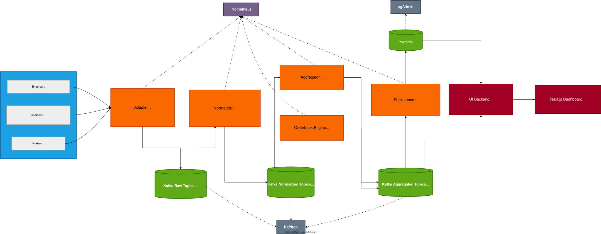
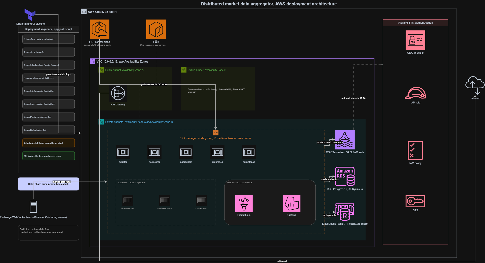
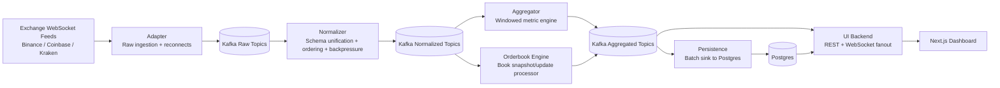
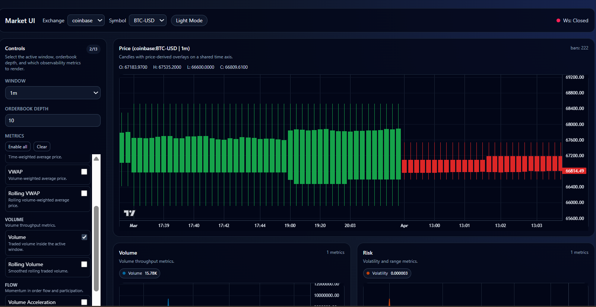
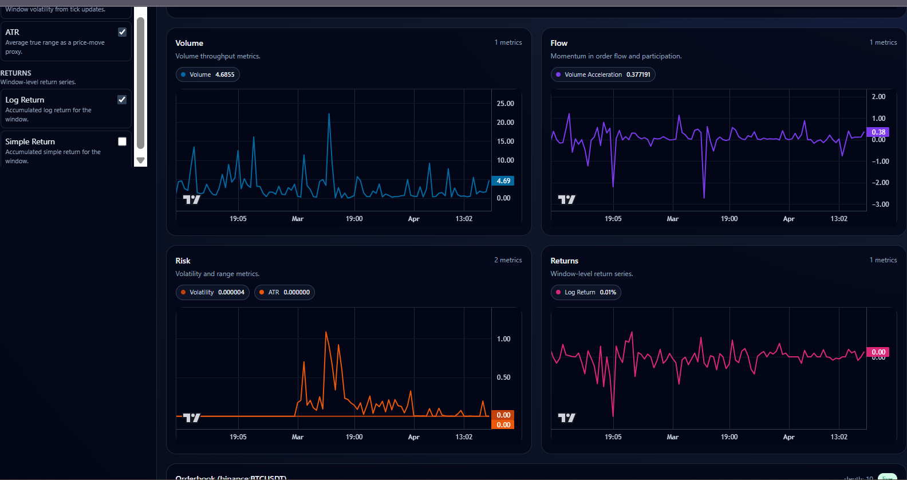
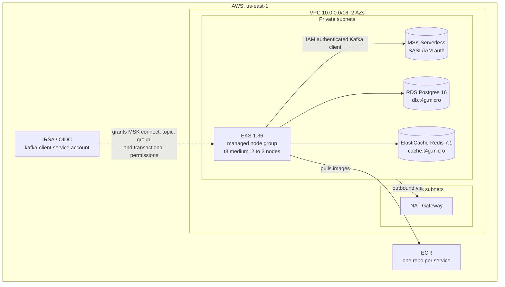
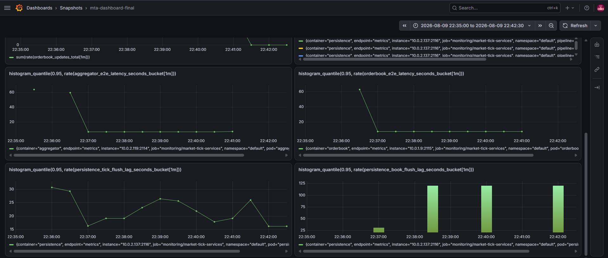
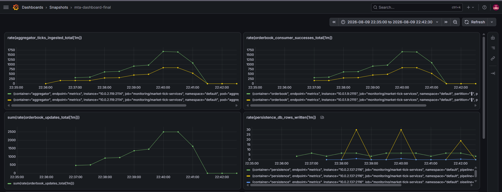
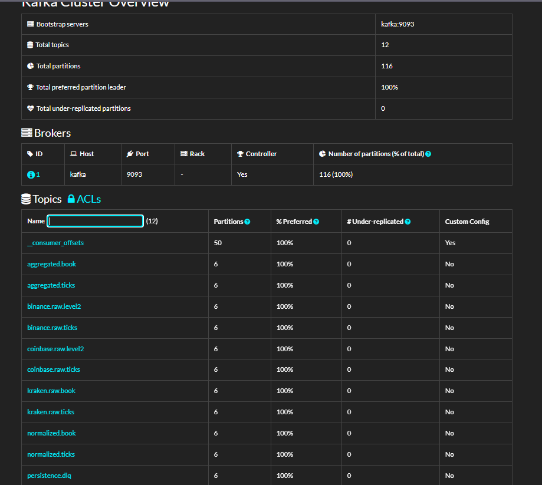

# Market Tick Aggregator

Market Tick Aggregator is an end to end real time market data platform. It ingests exchange feeds, normalizes the different payload shapes each exchange sends, computes windowed market metrics, persists the results to Postgres, and serves a live dashboard over REST and WebSocket.

The repository is built as a complete streaming system rather than a single Kafka demo or a UI only project. It shows how raw exchange events get translated into a clean internal contract, processed by independent services, stored durably, and inspected live by someone trying to make an informed trading decision.

## System Overview



## AWS Deployment Architecture

The full pipeline runs on real AWS infrastructure: EKS for the five pipeline services, MSK Serverless for Kafka, RDS for Postgres, and ElastiCache for Redis, all provisioned by Terraform and deployed through a scripted `apply-all.sh` sequence. Details and the automated deployment flow are further down under [AWS Infrastructure and Deployment](#aws-infrastructure-and-deployment); this diagram is the full picture up front.



## Dashboard Preview


## What This System Does

- Connects to live WebSocket feeds from Binance, Coinbase, and Kraken
- Publishes raw exchange events into Kafka topics
- Normalizes exchange specific payloads into shared tick and book schemas
- Preserves ordered processing per stream key
- Computes candles and derived metrics across windows from `5s` to `24h`
- Builds and flushes orderbook snapshots for live depth visualization
- Persists aggregated ticks and books into Postgres
- Exposes a Next.js dashboard backed by REST for historical seed data and WebSocket for live updates
- Exposes observability surfaces through Prometheus, Kafdrop, and pgAdmin
- Deploys to real AWS infrastructure (EKS, MSK Serverless, RDS, ElastiCache) and has been validated end to end there under a ramped load test

## Why This Project Is Interesting

This project demonstrates:

- multi exchange protocol handling, including the quirks each exchange has around symbol resync and sequencing
- Kafka based event transport, with transactional exactly once processing on the hops that need it
- keyed ordered processing
- backpressure and bounded queue management
- circuit breaker protected Kafka calls in the orderbook service, and threshold based backpressure control in the normalizer
- tumbling and rolling metric computation
- replay safe persistence
- a real cloud deployment on EKS and MSK, load tested and profiled rather than just benchmarked locally
- an observability UI built directly on top of the streaming system

## Architecture

The image above is the presentation friendly system view. The flowchart below is the editable text version of the same architecture.


```mermaid
flowchart LR
    A[Exchange WebSocket Feeds<br/>Binance / Coinbase / Kraken]
    B[Adapter<br/>Raw ingestion + reconnects]
    C[(Kafka Raw Topics)]
    D[Normalizer<br/>Schema unification + ordering + backpressure]
    E[(Kafka Normalized Topics)]
    F[Aggregator<br/>Windowed metric engine]
    G[Orderbook Engine<br/>Book snapshot/update processor]
    H[(Kafka Aggregated Topics)]
    I[Persistence<br/>Batch sink to Postgres]
    J[(Postgres)]
    K[UI Backend<br/>REST + WebSocket fanout]
    L[Next.js Dashboard]

    A --> B --> C --> D --> E
    E --> F --> H
    E --> G --> H
    H --> I --> J
    H --> K
    J --> K --> L
```

## Data Flow

1. The `adapter` connects to exchange WebSocket feeds and publishes raw events into Kafka.
2. The `normalizer` consumes raw topics, converts payloads into shared schemas, and enforces per stream ordering.
3. Normalized ticks are consumed by the `aggregator`, which computes OHLC candles and derived metrics.
4. Normalized books are consumed by the `orderbook` service, which maintains in memory books and flushes top of book snapshots.
5. The `persistence` service batches aggregated Kafka records into Postgres.
6. The `ui-backend` reads historical data from Postgres and live updates from Kafka.
7. The `ui` dashboard renders historical seed data first, then continues live via WebSocket.

## Modules

| Module | Role |
| --- | --- |
| [`adapter`](adapter/README.md) | Exchange feed ingestion and raw Kafka publishing |
| [`normalizer`](normalizer/README.md) | Exchange schema unification, ordering, backpressure |
| [`aggregator`](aggregator/README.md) | Windowed OHLC and metric computation |
| [`orderbook`](orderbook/README.md) | In memory book maintenance and orderbook flush generation |
| [`persistence`](persistence/README.md) | Batched durable sink into Postgres |
| [`ui-backend`](ui-backend/README.md) | REST + WebSocket API layer |
| [`ui`](ui/README.md) | Dashboard for candles, grouped metrics, and orderbook depth |
| `mockexchange` | Standalone WebSocket servers that replay Binance/Coinbase/Kraken's real feed protocols at a controlled rate, used to load test the pipeline without touching real exchanges |
| `shared` | Shared logging, config, and metrics helpers |

## Notable Engineering Decisions

A few things in this codebase are worth calling out specifically, because they came from real problems rather than being designed in up front.

**Kafka transactions instead of Redis based deduplication.** Earlier versions of the aggregator and normalizer detected duplicate processing with a Redis backed dedupe key checked and marked on every tick. That path has since been replaced with Kafka's own transactional guarantees. Both services now give each worker its own `GroupTransactSession`, since each worker owns a disjoint set of partitions from the consumer group, and that session reads, processes, and produces within a single transaction before committing its consumed offsets as part of that same transaction. Downstream consumers read with `read_committed` isolation, so nothing partially processed ever becomes visible. This removed a Redis round trip from the hot path entirely and made correctness a property of the Kafka protocol rather than something the application had to maintain by hand.

**A real REST based resync path for Binance's depth stream.** Binance's WebSocket depth feed never sends an initial snapshot, unlike Coinbase and Kraken, which do. So the first time the normalizer sees a symbol, or any time it detects that adapter's ring buffer dropped a message, it has to fetch a snapshot over Binance's REST API and splice it together with whatever deltas arrived in the meantime, buffered by sequence id until the splice completes. This runs as a single in flight async fetch guarded by a pending flag, with the result posted back through the worker's own event loop so there is no data race on the buffered state.

**A `sync.Pool` for adapter's WebSocket read path.** A pprof heap profile taken during a live load test showed that 89 percent of adapter's live heap, 54 of 60 megabytes, was a single call site: `io.ReadAll` allocating a fresh buffer for every inbound exchange message. Since the resulting byte slice only needs to survive long enough for the normalizer step to copy what it needs out of it, adapter now checks out a reusable buffer from a pool, reads the message into it, and returns it once it has been consumed. That change alone dropped adapter's live heap to 6.8 megabytes on the same load test. Details and the before and after numbers are in the AWS load test section below.

## Exchanges and Streams

The current development configuration focuses on one instrument per exchange so the full stack remains easy to run locally and in containers:

| Exchange | Tick Stream | Orderbook Stream | Symbol |
| --- | --- | --- | --- |
| Binance | `aggTrade` | `depth` | `BTCUSDT` |
| Coinbase | `ticker` | `level2_batch` | `BTC-USD` |
| Kraken | `ticker` | `book` | `BTC/USD` |

Coinbase orderbook uses `level2_batch` so book data can be consumed without authenticated WebSocket setup while the downstream pipeline still treats it as logical level 2 data.

## Windows and Metrics

The aggregator computes metrics over multiple windows:

- `5s`
- `10s`
- `30s`
- `1m`
- `2m`
- `5m`
- `10m`
- `30m`
- `1h`
- `2h`
- `6h`
- `12h`
- `24h`

Representative metrics include:

- OHLC candles
- VWAP
- TWAP
- rolling VWAP
- volume
- rolling volume
- volume acceleration
- volatility
- ATR
- EMA
- SMA
- log return
- simple return
- microprice

The UI groups metrics by family so values with incompatible units are not forced onto the same axis.





## Orderbook View

The dashboard includes a live orderbook pane backed by REST snapshots and WebSocket continuation.


## Repository Structure

```text
.
|-- adapter/
|-- normalizer/
|-- aggregator/
|-- orderbook/
|-- persistence/
|-- ui-backend/
|-- ui/
|-- mockexchange/
|-- shared/
|-- scripts/
|-- infra/
|   |-- terraform/
|   |-- k8s/
|   |-- helm/
|   `-- scripts/
|-- docs/
|-- docker-compose.yml
`-- docker-compose.app.yml
```

## Local Development Mode

In local development mode, infrastructure runs in Docker:

- Kafka
- ZooKeeper
- Redis
- Postgres
- Prometheus
- Kafdrop
- pgAdmin

Application services run from source through repository scripts:

```bash
docker compose up -d postgres redis zookeeper kafka kafka-init prometheus kafdrop pgadmin
cd ui && npm install && cd ..
bash scripts/start-core-modules.sh
```

Useful URLs:

- Dashboard: `http://localhost:3000`
- UI backend: `http://localhost:8080`
- Prometheus: `http://localhost:9090`
- Kafdrop: `http://localhost:9000`
- pgAdmin: `http://localhost:5050`

## Containerized Deployment Mode

The repository also supports a containerized deployment where each module runs as its own service.

Files:

- `docker-compose.yml`: infrastructure services
- `docker-compose.app.yml`: application services
- `prometheus.yml`: scrape config for host run services
- `prometheus.app.yml`: scrape config for app containers

Start the full stack:

```bash
docker compose -f docker-compose.yml -f docker-compose.app.yml up --build
```

This brings up:

- infrastructure containers
- one shot Postgres schema and partition bootstrap
- background partition maintainer
- each application service in its own container
- Prometheus configured against container targets

Container specific notes:

- app services use `CONFIG_FILE=./config/docker.config.yaml`
- Redis backed services use `redis:6379`
- Postgres backed services use `postgres:5432`
- UI backend reads CORS origins from environment
- the frontend image is built with public API and WebSocket URLs baked into the build

This deployment path has been validated end to end with:

```bash
docker compose -f docker-compose.yml -f docker-compose.app.yml up --build
```

## AWS Infrastructure and Deployment

The pipeline also runs on real AWS infrastructure, provisioned with Terraform and deployed to EKS.


```mermaid
flowchart TB
    subgraph AWS["AWS, us-east-1"]
        subgraph VPC["VPC 10.0.0.0/16, 2 AZs"]
            subgraph Pub["Public subnets"]
                NAT[NAT Gateway]
            end
            subgraph Priv["Private subnets"]
                EKS["EKS 1.36<br/>managed node group<br/>t3.medium, 2 to 3 nodes"]
                MSK[("MSK Serverless<br/>SASL/IAM auth")]
                RDS[("RDS Postgres 16<br/>db.t4g.micro")]
                REDIS[("ElastiCache Redis 7.1<br/>cache.t4g.micro")]
            end
        end
        ECR["ECR<br/>one repo per service"]
        IRSA["IRSA / OIDC<br/>kafka-client service account"]
    end

    EKS -->|IAM authenticated Kafka client| MSK
    EKS --> RDS
    EKS --> REDIS
    EKS -->|pulls images| ECR
    IRSA -.grants MSK connect, topic, group,<br/>and transactional permissions.-> EKS
    Priv -->|outbound via| NAT
```

Every service authenticates to MSK Serverless over SASL/IAM through IRSA rather than static credentials: an EKS service account is federated through the cluster's OIDC provider, assumes an IAM role scoped to exactly the Kafka actions each pod needs (connect, topic access, group access, and transactional id access for the services using Kafka transactions), and MSK never sees a long lived secret.

Deployment itself is scripted rather than manual. Terraform provisions the VPC, EKS cluster, MSK cluster, RDS instance, ElastiCache instance, and one ECR repository per service, and a `null_resource` in the same Terraform run builds and pushes every service's Docker image whenever the image tag changes, so there is no separate manual build step. A single script, `infra/scripts/apply-all.sh`, drives the whole sequence: Terraform apply, kubeconfig setup, the shared `infra-config` ConfigMap that every pod reads its Kafka and database connection info from, Postgres schema bootstrap, Kafka topic creation, and finally rolling out all five pipeline services. The image tag auto increments on each `--rebuild` run so there is never a moment where the wrong image is briefly live. `infra/scripts/run-loadtest.sh` and `infra/scripts/destroy-all.sh` handle the load test lifecycle and teardown the same way, so the whole environment can be brought up, exercised, and torn down without any manual AWS console work.

## Performance

### How the numbers were measured

Go microbenchmarks require no infrastructure and exercise the actual production code:

```bash
# Core aggregation hot-path
go test -bench=. -benchmem -benchtime=5s ./aggregator/worker/

# Individual metric implementations
go test -bench=. -benchmem -benchtime=3s ./aggregator/internal/aggmetrics/
```

These use Go's built in `testing` framework, which runs each function in a tight loop and divides elapsed wall time by iteration count. The code under test is the `ProcessTick` and `FlushWindow` functions. Numbers are reproducible by cloning and running the same commands.

### Results (12th Gen Intel i7-1255U)

**Aggregator hot path** (`aggregator/worker/bench_test.go`):

| Benchmark | ns/op | Allocs/op | Throughput |
| --- | --- | --- | --- |
| ProcessTick, 1 window, 10 metrics | 462 ns | 2 | ~2.2M ticks/sec per worker |
| ProcessTick, 13 windows, 130 metric updates | 2,524 ns | 2 | ~396K ticks/sec per worker |
| FlushWindow, apply metrics + proto serialise | 1,138 ns | 10 | n/a |

With 16 workers (production `worker_count`), aggregate CPU capacity is roughly 6M ticks/sec before Kafka I/O becomes the bottleneck.

**Individual metric updates** (`aggregator/internal/aggmetrics/metric_bench_test.go`), all zero heap allocations:

| Metric | ns/op |
| --- | --- |
| VWAP | 2.3 |
| Rolling VWAP (bucket ring buffer) | 2.4 |
| EMA (exponential decay) | 3.0 |
| ATR (Average True Range) | 4.3 |
| OHLC (tumbling min/max) | 4.5 |
| Rolling Volume (ring buffer) | 5.1 |

After a load test run, per service processing metrics are visible in Prometheus at `http://localhost:9090`:

- `aggregator_tick_processing_duration_ms`, per tick hot path duration
- `aggregator_window_flush_duration_ms`, window flush and serialization duration
- `normalizer_commit_latency_seconds`, Kafka offset commit latency

## AWS End to End Load Test

Beyond the local Go microbenchmarks above, the full pipeline was deployed to the AWS infrastructure described above and load tested end to end using the `mockexchange` servers, which replicate Binance, Coinbase, and Kraken's real feed protocols closely enough that adapter cannot tell the difference. The test ramped from 500 to 10,000 combined messages per second.

**End to end latency** (`aggregator_e2e_latency_seconds` and `orderbook_e2e_latency_seconds`, p95, measured from exchange event origination to pipeline pickup):

| Path | p95 latency |
| --- | --- |
| Aggregator, tick path | ~7.1 to 7.4 seconds |
| Orderbook, book path | ~7.3 to 7.4 seconds |

These match. Orderbook initially ran about four times slower, 25 to 29 seconds p95, because of an unconditional 20 second message buffering window in the normalizer that was meant to smooth millisecond scale WebSocket jitter but was sized far larger than the problem it was solving. Getting there took ruling out AWS network causes by reproducing the same latency on a local docker-compose stack, ruling out backpressure churn by correlating pause and resume timestamps directly, and ruling out a Binance specific resync path with its own metric before finding the real cause in the normalizer's message ordering code.




**Heap allocation** (pprof `inuse_space`, captured against live pods during the load ramp): adapter's live heap dropped from 60.43MB to 6.8MB, an 89 percent reduction, after replacing a per message `io.ReadAll` allocation in the WebSocket read path with a `sync.Pool` backed reusable buffer, described above under Notable Engineering Decisions. Both numbers were captured on the same running pods under the same load, not derived from a synthetic benchmark.

**CPU usage under the 10K msg/sec ramp** (30 second pprof CPU profile, percentage of wall clock time actually spent executing rather than idle or blocked on I/O):

| Service | CPU busy |
| --- | --- |
| Normalizer | ~33.5% |
| Adapter | ~28.4% |
| Aggregator | ~1.0% |
| Orderbook | ~0.7% |
| Persistence | ~0.1% |

Aggregator, orderbook, and persistence sitting at close to idle under real load is consistent with the near zero allocation hot paths measured in the local benchmarks above, not a sign of missing instrumentation. Most of the system's CPU time goes to adapter and normalizer, since that is where the WebSocket handling, TLS, and Kafka produce and compression work sits, right at the front of the pipeline. Full pprof text captures, CPU and heap, for all five services are in [`docs/aws_loadtest_pprof/`](docs/aws_loadtest_pprof/).

## Testing and Validation

Backend:

```bash
go test ./...
```

Frontend:

```bash
cd ui
npm run lint
npm run build
```

Compose validation:

```bash
docker compose -f docker-compose.yml -f docker-compose.app.yml config
```

## Observability

Kafdrop is useful for checking topic flow:



Prometheus exposes service metrics:


## Engineering Tradeoffs

- explicit service boundaries over a monolith
- bounded queues and backpressure over pretending the pipeline is lossless under overload
- Kafka transactions for exactly once processing on the Kafka to Kafka hops (normalizer, aggregator), rather than an application level dedupe check, with the final Postgres sink staying replay safe rather than claiming exactly once all the way through
- a demoable dashboard as a first class consumer of the system
- single node deployment as the default operational model for simplicity and reviewability, with a full AWS deployment path available and validated separately

## Project Status

The stack is operational end to end in local, containerized, and AWS deployed modes. The repository contains the full streaming pipeline, observability surfaces, deployment automation, architecture documentation, a real cloud load test with root caused fixes, and the screenshots and profiling data needed to present the system as a complete project.
